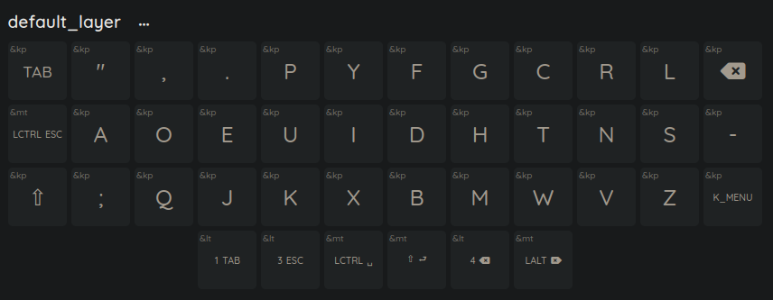
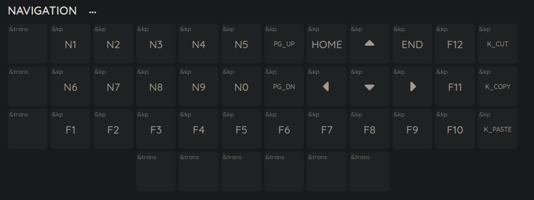
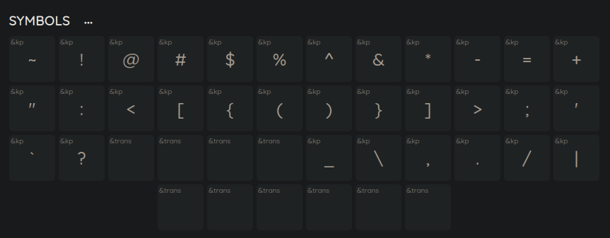
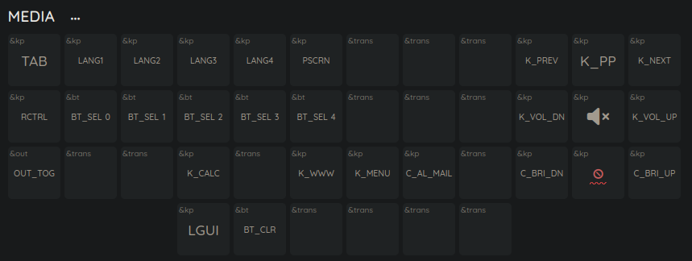

# zmk-config

dvorak layout for aurora corne 3X6, created using web-based zmk keymap editor

https://github.com/nickcoutsos/keymap-editor

you'll need to enable dvorak layout in you OS, otherwise symbols layer and symbols from default layer will not work as expected

I didn't create pure zmk dvorak layout to minimize the number of problems with games and non-English layouts, so qwerty keycodes layout is used for default layer

NOTE: these screenshots show symbols you'll get after setting dvorak layout in your OS. Please check images in docs/img/ to see real keycodes.

default layer 0

navigation layer 3

symbols layer 4

media layer

the remaining layers are not used and can be used for experiments
